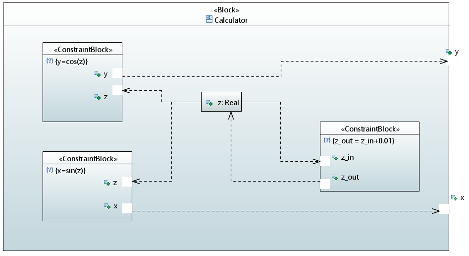
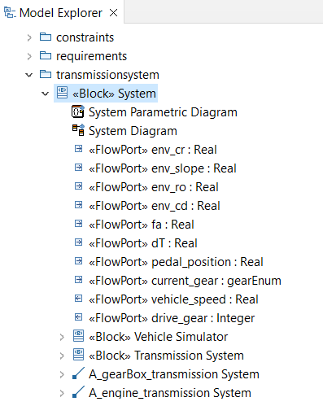
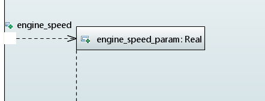

# SysML Parser: Model simulations for Eclipse Papyrus

Hi there!

This project allows you to generate Python classes from a SysML model built with Papyrus. 

## Modeling Guide

Please refer to <a href="https://github.com/anapschuch/sysml-parser/blob/main/docs/Modeling%20Guide%20-%20Electric%20Kettle.pdf" target="_blank">Kettle Modeling Guide</a> for help on 
how to create the project, diagrams and elements in Papyrus.
## Running the project

First, clone or download this repository.

Create a virtual environment:

```bash
$ python -m venv ./venv
```

Activate the virtual environment:

**Linux/Mac:**
```bash
$ source ./venv/bin/activate
```

**Windows:**
```bash
$ venv/Scripts/activate
```

Install the project requirements:
```bash
$ python -m pip install -r requirements.txt
```

To run the project, you need to specify the input file (the .uml generated from Papyrus project),
and the block you want to simulate. See the options available below:
```
usage: main.py [-h] [--print] file block

positional arguments:
  file        The .uml file generated from the Papyrus project
  block       The block you want to simulate

optional arguments:
  -h, --help  show this help message and exit
  --print     Use this option if you want to print the model info in the terminal.
              You can use '> out.txt' at the end of the command to save it in a file
```

## Examples

<details>
<summary> Calculator </summary>

Inside the examples' folder, you can find the *Math.uml* file, which represents the Papyrus output from a model that 
has the following block:



Basically,at each iteration, the z parameter in incremented by 0.01, and there are two outputs: y (the cos of z), 
and x (the sin of z). 

If you want to print information about the model, type in the terminal:

```bash
$ python main.py ./examples/Math.uml Calculator --print
```

To transform this model into Python classes, you can type:

```bash
$ python main.py ./examples/Math.uml Calculator
```

Two files will be generated inside the output folder: the *calculator.py* contains the Calculator block seen in the image above, 
while the *main.py* has the logic to simulate it. 

It's important to note that main has two simulation parameters set, the `dT` and `n_iter`, 
which are the time between two interactions, and the number of interactions, respectively. 
You can change it accordingly to your needs.

Additionally, by default, the *main.py* generates graphs of all output ports as a function of time. 
You can also change it as you desire.

To run this example, you can type:

 ```bash
$ python ./output/main.py 
```

Two graphs will be generated, one for each output port:

x             |  y
:-------------------------:|:-------------------------:
 | 

</details>

<details>
<summary> Transmission System </summary>

**More details coming shortly!**

There is also a more complete example available. 
This one is about an automatic transmission system of a car, in which the driver can choose between the four usual 
modes: Parking, Reverse, Neutral and Drive.

This model is based on the work done by Antony Stark in his personal blog. Please take a look [here](https://x-engineer.org/vehicle-acceleration-maximum-speed-modeling-simulation/) if you require additional information.


It receives the following inputs:

* `dT`: time between two iterations of the simulation
* `env_cr`: road load coefficient
* `env_slope`: slope angle of the road the car is in
* `env_ro`: air density
* `env_cd`: drag coefficient
* `fa`: frontal area of the car
* `pedal_position`: the percentage of the pedal that is pressed (a number between 0 and 100)
* `current_gear`: the gear (Parking, Reverse, Neutral and Drive) that the driver is in. 
  Note that there is an order that must be followed to change gears, e.g. the driver cannot go to Drive directly 
  from Parking, they must go to Reverse and Neutral first. This logic is inside a state machine in the model, so the mode will
  be changed only if your input is correct.
  
These inputs must be given to the simulation in the form of a file. 
You can check the *examples/inputs_transmission_system.csv* file that is available. Each line of represents an iteration, 
and an empty cell means that the input hasn't changed.

There are two outputs in this system, the vehicle speed, and the drive gear. In the drive gear, 
we can see how the automatic transmission is working. 

To generate the python files for this example, type:

```bash
$ python main.py ./examples/TransmissionSystem.uml System
```

You must change the csv input in the *output/main.py* file. After that, move the terminal to the output folder and start the simulation:

 ```bash
$ cd output
$ python main.py 
```

Below is the outputs generated from the inputs given:

vehicle speed (m/s)        |  drive gear
:-------------------------:|:-------------------------:
 | 
</details>


## How it works 

**This is a work in progress, it will be updated soon**

<details>
<summary> Modeling </summary>

In a Model-based Systems Engineering approach, the diagrams and artifacts are merely views of the system model, 
which is the single source of truth. This guarantees that there's no inconsistency between the diagrams, and any change made 
will be reflected in all the views. Furthermore, it's useful when communicating with stakeholders or team members, 
due to the possibility to show only the components that are interesting for the person looking at it. 

In this context, the parser reads elements of the model, not diagrams. This means that it doesn't take into account
the diagrams you chose while developing your system, nor how did you represented elements in it. What really matters 
are the connections and elements of the model. Below is a brief overview of the elements you can choose when modeling your system.

The parser allows you to simulate a block at a time. There are two ways to communicate parameters in a block: you can use 
FlowPorts when the information is coming into the block or getting out of it, and Properties to address states and internal 
parameters. To connect two elements (ports or properties), use an Item Flow. It allows you to represent the direction of the information,
from where it comes to where it goes.

If you want to represent some constraint between elements, use a Constraint Block. When defining the specification, do it through
an Opaque Expression. There you can define an equation that represents the relation between variables. Add Flow Ports to represent
the parameters that are being used in the constraint.

You can add nested blocks. To do so, please represent it as Block elements, not variables with some Block type. For example,
the TransmissionSystem block below has two inner blocks, the VehicleSimulator and the TransmissionSystem. 



You can also represent behaviors through state machines. Right now, we don't support parallel regions, and triggers 
and entry behaviors are the only actions that are understandable related to states. In this context, use Opaque Behaviors to represent actions
in state, and Change Events to represent triggers.

Additionally, in the simulation that is generated by the parser, the state machine will be updated before the block. 
So imagine that there is an `engine_speed_param` connected to an `engine_speed` port. In this case, if there is a state machine 
that updates the value of the `engine_speed_param`, this action would be overwritten by the value coming from the port. 
Model with this in mind: in state machines, only update the value of ports or 
properties that are not updated by other block data.


</details>

<details>
<summary> Supported elements </summary>

In the last session, we gave an overview of the elements that should be used when modeling the system, so they are understandable by
this parser. Here we will discuss technically the supported elements and where you can find them, and show the first step to extend this code.

If we look at the *.uml* file generated from Papyrus, we will see that it looks like the snippet below.

```xml
<ownedAttribute xmi:type="uml:Port" xmi:id="_WKF1QOESEeyXPMXG3lFeMw" name="env_cr" aggregation="composite">
    <type xmi:type="uml:PrimitiveType" href="pathmap://UML_LIBRARIES/UMLPrimitiveTypes.library.uml#Real"/>
</ownedAttribute>
```

Basically, there are different tag types. Some examples are ownedAttribute, type, defaultValue and ownedRule. 
The current supported types can be seen [here](https://github.com/anapschuch/xml-parser/blob/main/source/xml_types/xml_tag.py#L4).

If we take a look at the .uml file, we will see that the project structure is built with UML types, while the SysML ones come at the end, and refer to some UML type. 
For example, for the port in the snippet above, we can see that it is the base port of a FlowPort:

```xml
<DeprecatedElements:FlowPort xmi:id="_WKHqcOESEeyXPMXG3lFeMw" base_Port="_WKF1QOESEeyXPMXG3lFeMw" direction="in"/>
```

This will be important when associating elements in the parser.

In addition to this, the tags also have different attributes, like xmi:type, xmi:id, name and base_Port. 
The current supported attributes can be seen [here](https://github.com/anapschuch/xml-parser/blob/main/source/xml_types/xml_tag_attribute.py#L4).
Furthermore, there are different *xmi_type* values, which the supported ones can be seen [here](https://github.com/anapschuch/xml-parser/blob/main/source/xml_types/xmi_type.py#L4).

In case you run the project and face an error about a not found type, you can add it in these files. 
Note that we chose to restrict the allowed types because they must be associated with some logic later. 
Having a type in these files doesn't mean the parser understands what it means and how it interacts with the other elements in the model. 
This will be covered in the next session.
</details>

