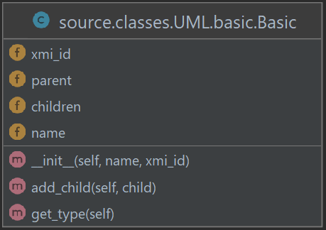
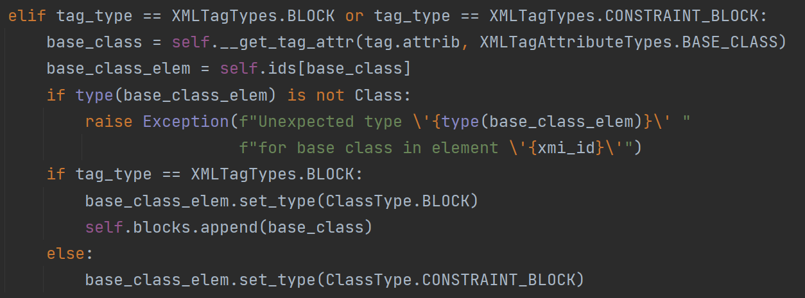

# SysML Parser: Model simulations for Eclipse Papyrus

Hi there!

This project allows you to generate Python classes from a SysML model built with Papyrus. 

## Modeling Guide

Please refer to <a href="https://github.com/anapschuch/sysml-parser/blob/main/docs/Modeling%20Guide%20-%20Electric%20Kettle.pdf" target="_blank">Kettle Modeling Guide</a> for help on 
how to create the project, diagrams and elements in Papyrus.
## Running the project

First, clone or download this repository.

Create a virtual environment:

```bash
$ python -m venv ./venv
```

Activate the virtual environment:

**Linux/Mac:**
```bash
$ source ./venv/bin/activate
```

**Windows:**
```bash
$ venv/Scripts/activate
```

Install the project requirements:
```bash
$ python -m pip install -r requirements.txt
```

To run the project, you need to specify the input file (the .uml generated from Papyrus project),
and the block you want to simulate. See the options available below:
```
usage: main.py [-h] [--print] file block

positional arguments:
  file        The .uml file generated from the Papyrus project
  block       The block you want to simulate

optional arguments:
  -h, --help  show this help message and exit
  --print     Use this option if you want to print the model info in the terminal.
              You can use '> out.txt' at the end of the command to save it in a file
```

## Examples

<details>
<summary> Calculator </summary>

Inside the examples' folder, you can find the *Math.uml* file, which represents the Papyrus output from a model that 
has the following block:

| Block |       Block's State Machine       |
:-------------------------:|:---------------------------------:
||  |

The block has two outputs, `x` and `y`, and an internal parameter `z`.
At each iteration, `z` is incremented by 0.01, `y` is the cosine of `z`, and `x` is the sine of `z`. In
addition, there is a state machine that resets the `z` value when it is bigger than pi.

If you want to print information about the model, type in the terminal:

```bash
$ python main.py ./examples/Math.uml Calculator --print
```

To transform this model into Python classes, you can type:

```bash
$ python main.py ./examples/Math.uml Calculator
```

The files below will be generated inside the output folder: 
```
output
├── utils
│   └─── helpers.py
├── calculator.py
├── calculator.yaml
├── calculator.PNG
└─── main.py
```

The *calculator.py* contains the Calculator block seen in the image above, 
while the *main.py* has the logic to simulate it. The *calculator.yaml* file stores the state machine
content, which will be read by Sismic, a Python library that defines and execute statecharts.

It's important to note that main has two simulation parameters set, the `dT` and `n_iter`, 
which are the time between two interactions, and the number of interactions, respectively. 
You can change it accordingly to your needs.

Additionally, by default, the *main.py* generates graphs of all output ports as a function of time. 
You can also change it as you desire.

To run this example, type:

 ```bash
$ python ./output/main.py 
```

Two graphs will be generated, one for each output port. The images below shows the outputs for `n_iter = 8000`.

x             |  y
:-------------------------:|:-------------------------:
 | 

</details>

<details>
<summary> Transmission System </summary>

There is also a more complete example available. 
This one is about an automatic transmission system of a car, in which the driver can choose between the four usual 
modes: parking, reverse, neutral and drive.

This model is based on the work done by Antony Stark in his personal blog. Please take a look [here](https://x-engineer.org/vehicle-acceleration-maximum-speed-modeling-simulation/) if you require additional information.


It receives the following inputs:

* `dT`: time between two iterations of the simulation
* `env_cr`: road load coefficient
* `env_slope`: slope angle of the road the car is in
* `env_ro`: air density
* `env_cd`: drag coefficient
* `fa`: frontal area of the car
* `pedal_position`: the percentage of the pedal that is pressed (a number between 0 and 100)
* `current_gear`: the gear (parking, reverse, neutral and drive) that the driver is in. 
  Note that there is an order that must be followed to change gears, e.g. the driver cannot go to drive directly 
  from parking, they must go to reverse and neutral first. This logic is inside a state machine in the model, 
  so the mode will be changed only if your input is correct.
  
These inputs must be given to the simulation in the form of a file. 
You can check the *examples/inputs_transmission_system.csv* file that is available. Each line of represents an iteration, 
and an empty cell means that the input hasn't changed.

There are three outputs in this system, the engine and vehicle's speed, and the drive gear. In the drive gear, 
we can see how the automatic transmission works. 

To generate the python files for this example, type:

```bash
$ python main.py ./examples/TransmissionSystem.uml System
```

You must change the csv input in the *output/main.py* file. After that, move the terminal to the output folder and 
run the simulation:

 ```bash
$ cd output
$ python main.py 
```

Below are the outputs generated from the inputs given:

vehicle speed (m/s)        |  drive gear | engine speed (rpm)
:-------------------------:|:-------------------------:|:-------------------------:
 |  | 
</details>


## How it works 

<details>
<summary> Modeling </summary>

In a Model-based Systems Engineering approach, the diagrams and artifacts are merely views of the system's model, 
which is the single source of truth. This guarantees that there's no inconsistency between the diagrams, and any change made 
will be reflected in all the views. Furthermore, it's useful when communicating with stakeholders or team members, 
due to the possibility to show only the components that are interesting for the person looking at it. 

In this context, the parser reads elements of the model, not diagrams. This means that it doesn't take into account
the diagrams you chose while developing your system, nor how you represented elements in it. What really matters 
are the connections and elements of the model. Below is a brief overview of the elements you can choose when modeling your system.

The parser allows you to simulate a block at a time. There are two ways to communicate parameters in a block: you can use 
FlowPorts when the information is coming into the block or getting out of it, and Properties to address states and internal 
parameters. To connect two elements (ports or properties), use an Item Flow. It allows you to represent the direction of the information,
from where it comes to where it goes.

If you want to represent some constraint between elements, use a Constraint Block. When defining the specification, do it through
an Opaque Expression. There you can define an equation that represents the relation between variables. Add Flow Ports to represent
the parameters that are being used in the constraint.

You can add nested blocks. To do so, please represent it as Block elements, not variables with some Block type. For example,
the System block below has two inner blocks, the VehicleSimulator and the TransmissionSystem. 

<p align="middle">

</p>

You can also represent behaviors through state machines. Right now, we don't support parallel regions. Entry behaviors
and inner state machines can be added in states. Triggers must be added in transitions that are not from the initial state.
In this context, use Opaque Behaviors to represent actions in state, and Change Events to represent triggers.

Additionally, in the simulation that is generated by the parser, the state machine will be updated before the block. 
So imagine that there is an `engine_speed_param` connected to an `engine_speed` port. In this case, if there is a state machine 
that updates the value of the `engine_speed_param`, this action would be overwritten by the value coming from the port. 
Model with this in mind: in state machines, only update the value of ports or 
properties that are not updated by other block data.

<p align="middle">

</p>

</details>

<details>
<summary> XML Types </summary>

In the last section, we gave an overview of the elements that should be used when modeling the system, so they are understandable by
this parser. Here we will discuss technically the supported elements and where you can find them, and show the first step to extend this code.

If we look at the *.uml* file generated from Papyrus, we will see that it looks like the snippet below.

```xml
<ownedAttribute xmi:type="uml:Port" xmi:id="_WKF1QOESEeyXPMXG3lFeMw" name="env_cr" 
                aggregation="composite">
    <type xmi:type="uml:PrimitiveType" href="pathmap://UML_LIBRARIES/UMLPrimitiveTypes.library.uml#Real"/>
</ownedAttribute>
```

Basically, there are different tag types. Some examples are ownedAttribute, type, defaultValue and ownedRule. 
The current supported types can be seen [here](https://github.com/anapschuch/xml-parser/blob/main/source/xml_types/xml_tag.py#L4).

If we take a look at the .uml file, we will see that the project structure is built with UML types, while the SysML ones come at the end, and refer to some UML type. 
For example, for the port in the snippet above, we can see that it is the base port of a FlowPort:

```xml
<DeprecatedElements:FlowPort xmi:id="_WKHqcOESEeyXPMXG3lFeMw" base_Port="_WKF1QOESEeyXPMXG3lFeMw" 
                             direction="in"/>
```

This will be important when associating elements in the parser.

In addition to this, the tags also have different attributes, like xmi:type, xmi:id, name and base_Port. 
The current supported attributes can be seen [here](https://github.com/anapschuch/xml-parser/blob/main/source/xml_types/xml_tag_attribute.py#L4).
Furthermore, there are different *xmi_type* values, and the supported ones can be seen [here](https://github.com/anapschuch/xml-parser/blob/main/source/xml_types/xmi_type.py#L4).

In case you run the project and face an error about a not found type, you can add it in these files. 
Note that we chose to restrict the allowed types because they must be associated with some logic later. 
Having a type in these files doesn't mean the parser understands what it means and how it interacts with the other elements in the model. 
This will be covered in the next section.
</details>

<details>
<summary> Parsing XML tag elements </summary>

Basically each tag that is important for the simulation is transformed into a Python
class or is used to update an existing element. The Figureure below shows the current class files that
are used in the parser. Almost all classes derive from a Basic class, which implements
common attributes and methods. The ones that do not inherit from the Basic are simpler,
such as the `PrimitiveType`, which stores only a reference to the type.

<p align="middle">


</p>

The idea is similar to the XML tags: each class can add children and transform them
into attributes that have some meaning. For example, the code snippet below shows the
Property class. Note that, in addition to the default attributes, it has other two, `type`
and `default_value`. The method `add_children` sets these attributes, depending on the
type of child received. In the case of an unexpected child, an error is thrown.

```python
class Property(Basic):
    def __init__(self, name, xmi_id):
        super().__init__(name, xmi_id)
        self.type = None
        self.default_value = None

    def add_children(self, child):
        if type(child) is PrimitiveType:
            self.type = child.type
        elif type(child) is DefaultValue:
            self.default_value = child.value
        else:
            raise Exception("Unexpected child for UMLProperty: " + type(child))

    def print(self, indentation):
        print(' ' * indentation, f"Property: {self.xmi_id} - {self.name}", sep="")
        if self.default_value is not None:
            print(' ' * (indentation + 2), f"Default Value: {self.default_value}", sep="")
```


The `SysMLParser` class is responsible for transforming the whole XML content into
Python elements. The Figure below shows the main attributes and methods of this class. It is
important to mention that private attributes and methods were hidden in this diagram,
because they are internal to the class and exist only to help parse elements.

<p align="middle">

</p>

Below each element is explained with more details:
* `get_block method`: from the name given as an input, returns the block element if
it exists.
* `parse_tag method`: this is the most important function of this class. Depending on
the tag type and xmi type received, an element of one of the classes discussed above
is created or updated (or noting is done, in case of receiving a tag that is not used
in the simulation). Children of this tag are parsed recursively, and added in the
element created (using the `add_children` function mentioned before). This method
also populates the attributes of the `SysMLParser` class, as discussed in other items.

* `__init__`: method called when the class is created. Receives the path of the file in
which the model is stored. It parses this file calling the `parse_tag` function for all
children of the root node.

* `ids`: a dictionary containing all the ids that reference an element supported by
the parser. This is used when we have an element that is linked to another. For
example, Flow Ports are defined using a `base_Port`, while Constraint Blocks have a
`base_Class`. See the XML snippet below:

```xml
<Blocks:Block xmi:id="_NL_F0EqREe2YPdtfy5e7BA" base_Class="_NL9QoEqREe2YPdtfy5e7BA"/>
<PortsAndFlows:ItemFlow xmi:id="_hk7oAEqpEe2YPdtfy5e7BA" base_InformationFlow="_hk5y0EqpEe2YPdtfy5e7BA"/>
<ConstraintBlocks:ConstraintBlock xmi:id="_dlF4oEtJEe2YPdtfy5e7BA" base_Class="_dkEk8EtJEe2YPdtfy5e7BA"/>
<DeprecatedElements:FlowPort xmi:id="_gpbMUEtJEe2YPdtfy5e7BA" base_Port="_go8EIEtJEe2YPdtfy5e7BA" 
                             direction="in"/>
```

Both Blocks and Constraint Blocks reference a UML Class. Therefore, to know
the type of a class, we need to search for a tag that references its xmi:id in the
`base_Class` attribute.

* `blocks`: a vector containing all the ids of the SysML blocks found in this file. Every
time we find a tag that references a block, we add its base class id in this vector
(the base class is the element that has all the information of the block, i.e, ports,
constraints, state machines, etc). This attribute is useful because, since the tool
allows the simulation of a block in the system, when the user inputs the name of
desired block the program will search for it looking for the ids that are in this vector.
The Figure below shows the piece of code where this vector is populated.

<p align="middle">

</p>

* `items_flow` and `items_flow reversed`: dictionaries containing all the Item Flow elements found in the XML content. 
When we use an Item Flow to connect two elements, they are not necessarily created inside the block that contains its 
endings. Therefore, all the ones found in the model are saved in this attribute. For the `items_flow` dictionary, 
the keys are the source ids, while the values are a vector containing all the target ids that are connected with 
the source key. Analogous for `items_flow_reversed`, but with target ids being the keys. 

* `triggers` and `events`: when we create state machines, all transitions (excluding the one from the initial state) must 
have a trigger. As mentioned in the 'Modeling' section, we use Change Events to represent state transitions. For example, 
take a look at the two snippets below. In the first one, the transition has a trigger with event 
attribute equals to `_ymIu4EtcEe2YPdtfy5e7BA`, referencing a Change Event that checks if `power_toggle` is enabled 
(second XML snippet).
```xml
<transition xmi:type="uml:Transition" xmi:id="_wM6qMEtbEe2YPdtfy5e7BA" source="_nryWoEtbEe2YPdtfy5e7BA" 
            target="_jvKJAEtbEe2YPdtfy5e7BA">
    <trigger xmi:type="uml:Trigger" xmi:id="_ViFUYEtdEe2YPdtfy5e7BA" event="_ymIu4EtcEe2YPdtfy5e7BA"/>
</transition>
```

```xml
<packagedElement xmi:type="uml:ChangeEvent" xmi:id="_ymIu4EtcEe2YPdtfy5e7BA" name="power on">
    <changeExpression xmi:type="uml:OpaqueExpression" xmi:id="_OrWGEEtdEe2YPdtfy5e7BA">
        <language>Natural language</language>
        <body>power_toggle</body>
    </changeExpression>
</packagedElement>
```

Therefore, since events allow the transitions to happen, the triggers dictionary
stores all the triggers that are attached with an event, which is the dictionary key.
In addition, the events data structure stores the event info, based on the event id,
which is the key for this dictionary.

<p align="middle">

</p>

</details>
<details>
<summary>Generated files</summary>

To walk through how the files are generated, we will be using the Calculator example. The Figure below shows
the class diagram for the source code generated for this example.

<p align="middle">

</p>

Blocks are transformed into classes that inherit from a helper class called `Block`, while
Constraint Blocks inherit from `ConstraintBlock` helper class. Both of this helpers inherit
from the `Basic` class. The file `generator.py`, located inside the source folder, contains the
auxiliary functions used to generate the classes and output files in general. Below we will
cover how constraints, state machines and blocks are generated with more details.

### Constraints

All constraints from a block are transformed into classes and their code is stored
in the same file of the block. For example, the Calculator class is stored in the file
`calculator.py`, which has the implementation of this class and the internal constraint
blocks X, Y and Z. The code that implements a Constraint Block is really simple, and an
example is shown below.

```python
class Y(ConstraintBlock):
    def __init__(self):
        super().__init__()
        self.inputs = ['_fe9qkDlREe2ZHoYOIYCrsA']
        self.add_port('_ccR8sDlREe2ZHoYOIYCrsA', 'y')
        self.add_port('_fe9qkDlREe2ZHoYOIYCrsA', 'z')

    def update(self):
        if not self.check_if_all_values_are_set():
            return

        self.attrs['y']=cos(self.attrs['z'])
```

Basically, all input and output ports are added in the initialization, and the inputs are
also stored in a vector called `inputs`. This is used to check if all input port values are set,
so the outputs can be calculated. In addition, there is an `update` function that updates
the output values based on the inputs.

### State Machines

To deal with state machine behaviors, we are using a Python library called Sismic,
which provides a set of tools to define and execute statecharts.
Inside the parser code, there is a class called `StateMachineGenerator`, that will transform
an instantiation of the class `StateMachine` into a `.yaml` file that can be read by this library.
The snippet below shows the generated `.yaml` file for the Calculator’s state machine.

```yaml
statechart:
  name: Calculator
  root state:
    name: Region
    initial: Reset
    states:
      - name: Reset
        on entry: |
          attrs['z'] = 0
        transitions:
          - target: Reset
            event: reset z

```

Once this file is generated, an attribute that stores the state machine is created in the
main block. For example, looking back at the class diagram, the class Calculator has an attribute
called `calculator_sm`.

Note that in the yaml file the events are mentioned using their name. That said, blocks
also have an `update_state_machine` function that execute events based on their specification. 
To generate this function, the triggers and events dictionaries of the `SysMLParser`
class mentioned earlier are used. Below is the code that updates the Calculator’s state
machine.

```python
    def update_state_machine(self):
        if not self.check_if_all_values_are_set():
            return
        if self.attrs['z'] >= pi:
            self.calculator_sm.queue('reset z')
        self.calculator_sm.execute()
```

### Blocks

Blocks have helpers functions inherited from the helper class to define ports, properties
and inner classes (i.e, other blocks or constraint blocks), used when the class is initialized.
Another important concept for blocks is the order in which their internal structures are
updated, based on the Items Flow.

This order is calculated recursively, starting from the output ports. That is the reason
we have the structure `items_flow_reversed` in the parser. For example, if we look back
at the diagrams for the Calculator example, we will note that the outputs y and x depend on the Constraint Blocks Y
and X, respectively. Both of them depend on the internal property z, which depends on
the Constraint Block Z. Therefore, we must start considering the z value, then we can
update the constraint block Z, and after that update constraints X and Y, that will lead
to the output values. The order in which the items should be updated is stored in the
`update_order` attribute of each block.


In addition, all blocks have a function update that is inherited from the helper class
Block. In this function, the state machine is first updated, and then each internal structure
is also updated, based on the order defined by the `update_order` attribute. Furthermore,
the items flow are used to connect elements, updating parameters and port values.


</details>
<details>
<summary>Guide to add new elements</summary>

The steps below summarise what is needed to add new elements in the parser.

* First of all, the XML types of the element you want to add support to must be allowed in the program. 
Therefore, check if the enumerations `XMLTagTypes`, `XMLTagAttributeTypes` and `XMITypeTypes` contain the types 
of this new element. Look back at section XML Types further details.
    
* Go to the `SysMLParser` class. There, a function named `parse_tag` is responsible to transform a XML tag into some 
Python structure. It can be a class, such as the ones located inside the `source/classes` folder, or it can 
reference an element that already exists.

  - In case it is a new class: start by creating the class in the folder mentioned in the last paragraph. 
  After that, this element can be added inside another class as a child, or can be an independent structure, 
  such as the blocks. In the first scenario, you must go to the parent class and threat how this child will be added. 
  For an example on how to do so, look back at section 'Parsing XML tag elements' and see how the default value or 
  primitive type children are added for the property class. In the other scenario, add an attribute inside the 
  `SysMLParser` class that will store elements of this type. For example, you could add a `requirements` attribute to 
  store the Requirement Blocks. 
  - In case you are modifying an existing element: as mentioned earlier, some XML elements reference others using attributes
such as `base_Port` and `base_Class`. Therefore, to find this base element, use the `ids` dictionary of the parser class. 
After that, you can update the base element based on your needs.
      

* This last step depends on the element that you want to add and its scope in the model.
  - If the element is related to state machines: you should start checking how this structure or behavior can be 
  represented in Sismic, the Python library this work uses to define and execute state machines. After that, 
  the class `StateMachineGenerator` deals with transforming the Python classes into the `yaml` content that is 
  understandable by this state chart library.
        
  - Otherwise, this new element should probably be treated inside one of the auxiliary functions located in the 
  `generator.py` file. For example, the `generate_constraint_code` function deals with Constraint Blocks, while 
  `generate_output_files` function deals with the main Block classes.
    
Furthermore, if you are working with elements that do not affect the simulation itself, you can treat them 
directly in the main file. For example, we have mentioned that the `print_blocks_info` function, that prints the model 
information in the console, is called when the program runs with the print flag. In this scenario, if you only want 
to print the requirements, for example, you could create another flag in the execution options, add a function to 
implement the print logic and reference it in the main file. 
</details>